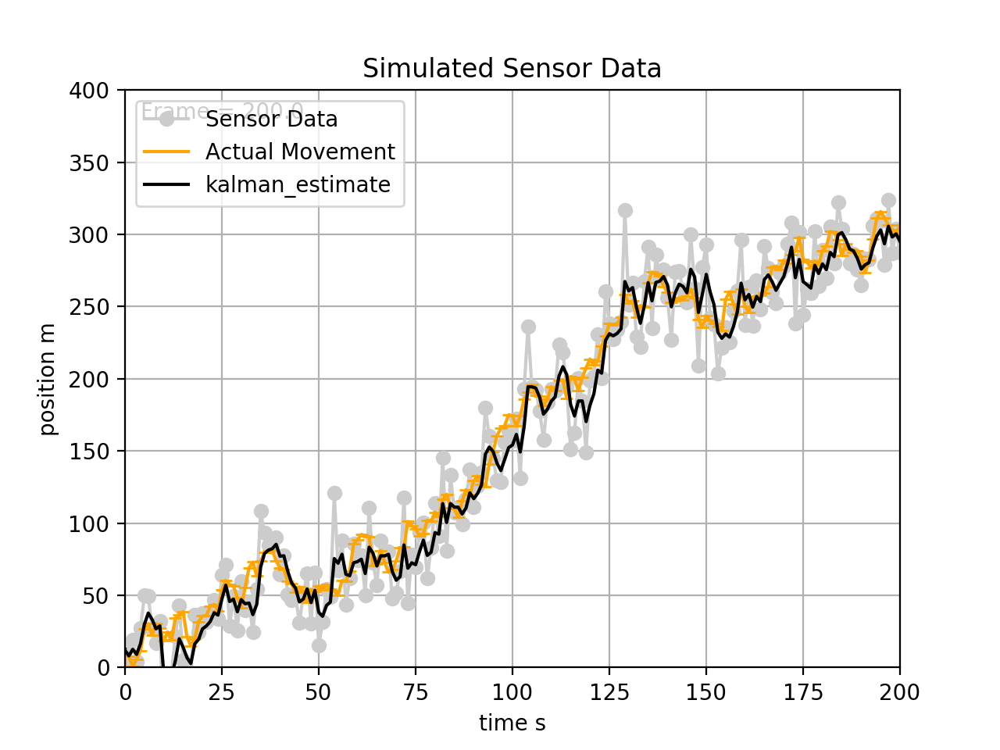
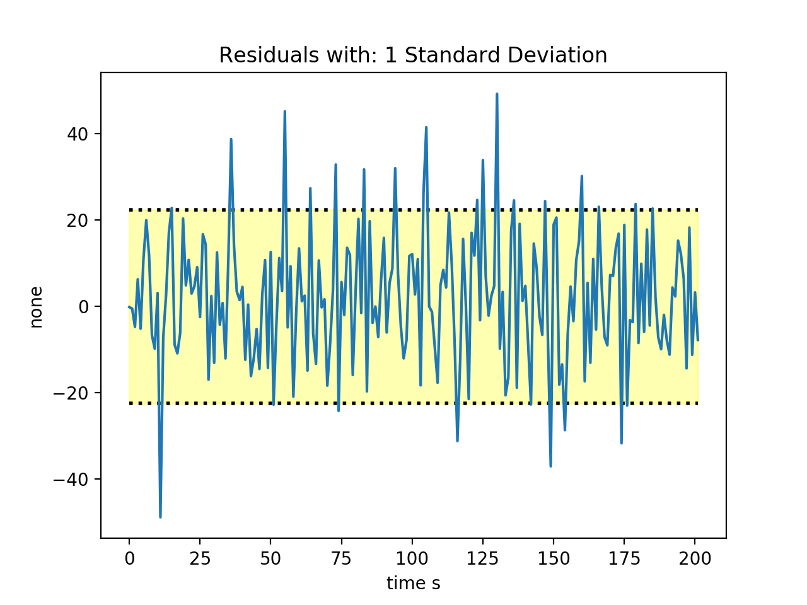
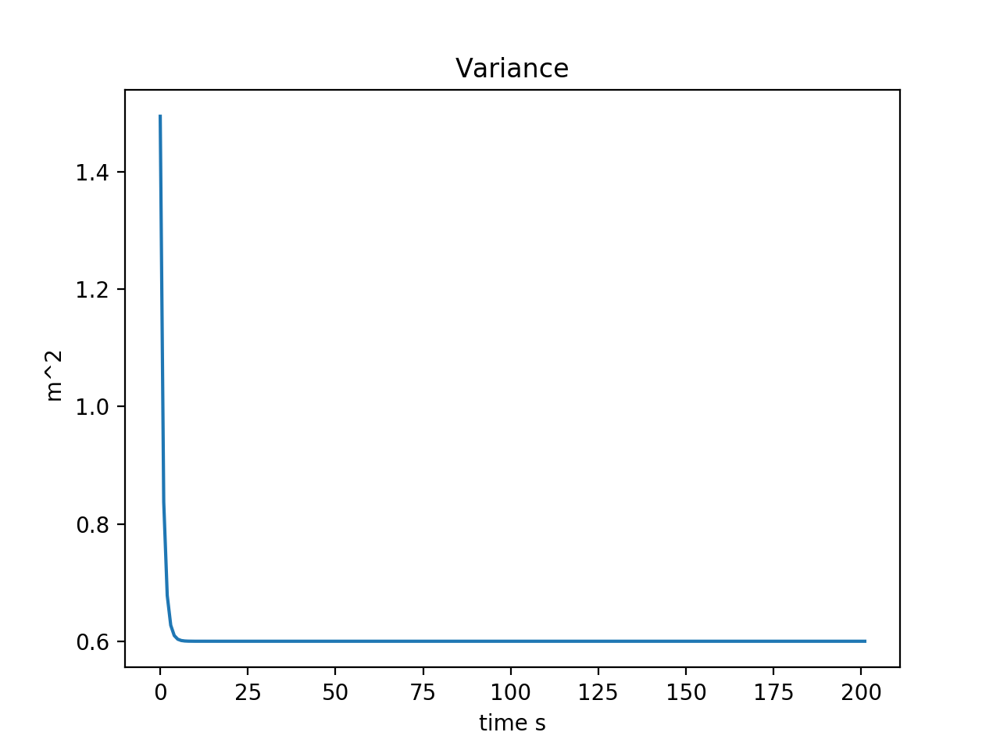

## Filters
Collection of Sensor Filters and visualizations for my studies

# Run Sample Simulation
Run liveg_v2.py in the graphs folder. The code simulates a trajectory, noisy sensor data and uses that data to build a kalman filtered approximation. At the end it prints what the variance of the kalman estimate converged to. Utilizing Gaussian Noise.

The actual position data is calculated by integrating simulated velocity data with some process noise. The kalman filter receives simulated sensor data, that is generated by adding noise to the position data.

To measure the effectiveness of the filter, we observe the persentage of the kalman residual measurements that are within a certain standard deviation of the sensor noise. In other words, if the sensor was perfect, the residual would be 0 - a horizontal line, the plot shows the error between sensor readings and the estimated position. To perform well, we expect 68% of the residual data to be inside the 1 standard deviation area that is plotted.

Variance can be thought of as a measure of certainty or confidence in the estimate. Provided our models are correct, we expect the variance to decrease indicating that the filter is becoming more certain of its prediction.